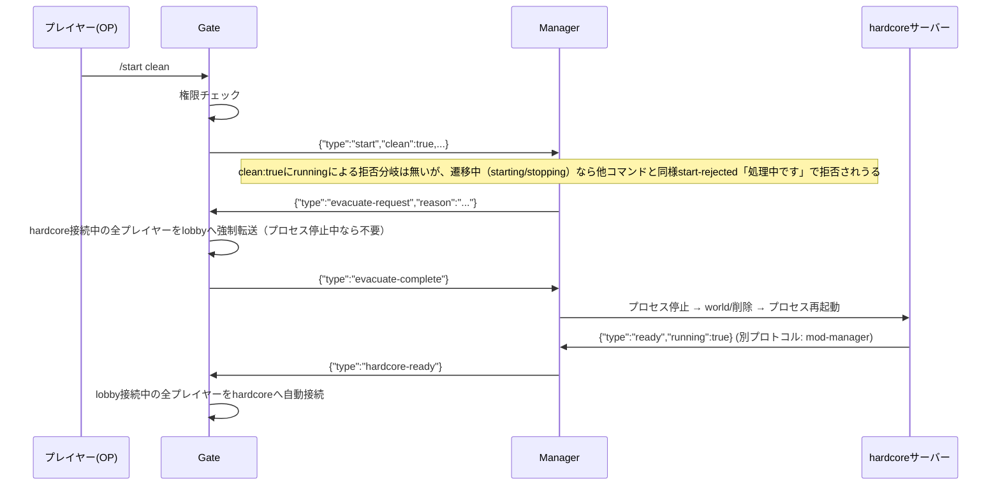
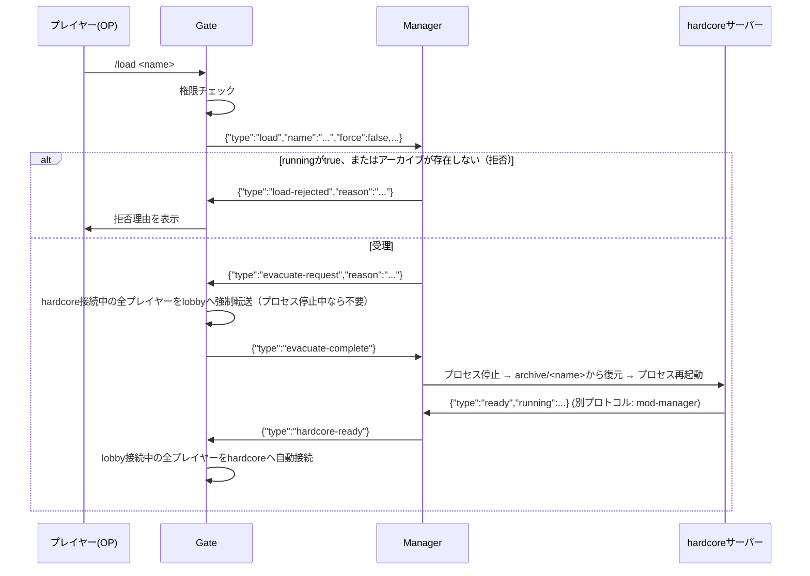
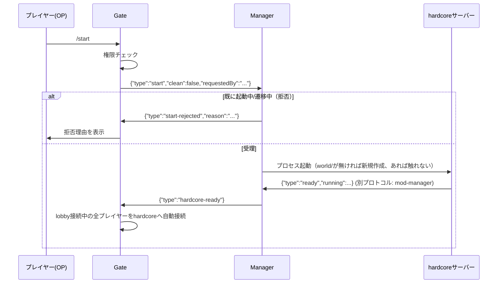
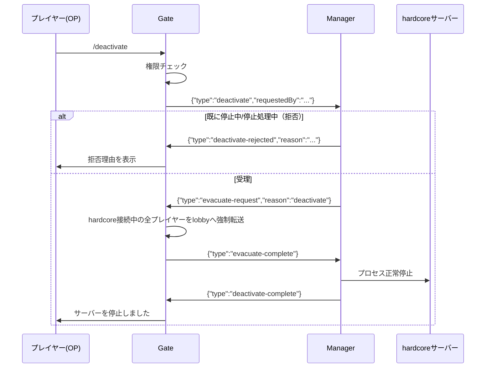

# Gate ⇔ Manager シグナルプロトコル

`specification.md` 7節の詳細版。Gate（プロキシ、Go）とManager（プロセス管理・アーカイブ・記録参照、Go）の間で、コマンド仲介と状態同期を行うためのプロトコル。

## 1. 前提・トランスポート

| 項目 | 内容 |
|---|---|
| トランスポート | TCPソケット |
| 待受アドレス | Manager側が設定可能（例：`0.0.0.0:<gateApiPort>`）。Docker network内のみで到達可能とし、ホストへは公開しない |
| 接続方向 | Gate → Manager（Gateがクライアント） |
| 接続タイミング | Gate起動時に接続を開始する。GateとManagerは共に常駐プロセスのため、どちらが接続してもよいが、`docs/protocol-mod-manager.md`と役割を揃えるためGateをクライアント側に統一する |
| 再接続 | 接続失敗・切断時は数回リトライ＋バックオフする |
| メッセージ形式 | NDJSON（Newline-Delimited JSON）。1メッセージ＝1行のUTF-8 JSONオブジェクト＋`\n` |
| 判別方法 | 各メッセージの`type`フィールドで種別を判別する |
| セキュリティ | Docker networkの到達範囲を信頼境界とし、TLS/認証は行わない（ホストへポートを公開しないことが前提） |

## 2. メッセージ一覧

| `type` | 方向 | 発生タイミング |
|---|---|---|
| `state-query` | Gate → Manager | `/rta`実行時など、hardcoreの現在状態を知りたいタイミングで都度送信 |
| `state-response` | Manager → Gate | `state-query`への応答 |
| `hardcore-ready` | Manager → Gate | `/start [clean]`・`/load`の一連処理が完了し、hardcoreが準備完了になった時（1回限りの完了通知） |
| `start` | Gate → Manager | `/start [clean]`受理時 |
| `load` | Gate → Manager | `/load <name\|latest> [force]`受理時 |
| `deactivate` | Gate → Manager | `/deactivate`受理時 |
| `start-rejected` | Manager → Gate | `start`要求をプロセス状態チェックで拒否した場合（`clean:false`のみ） |
| `load-rejected` | Manager → Gate | `load`要求を`running`チェックまたはアーカイブ存在チェックで拒否した場合 |
| `deactivate-rejected` | Manager → Gate | `deactivate`要求をプロセス状態チェックで拒否した場合 |
| `evacuate-request` | Manager → Gate | `start`（`clean:true`）/`load`/`deactivate`受理後、プロセスが起動中で止める前 |
| `evacuate-complete` | Gate → Manager | hardcore接続中の全プレイヤーをlobbyへ強制転送し終えた時 |
| `deactivate-complete` | Manager → Gate | `deactivate`によるプロセス停止が完了した時（1回限りの完了通知） |
| `savedata-query` | Gate → Manager | `/savedata`実行時 |
| `savedata-response` | Manager → Gate | `savedata-query`への応答 |
| `senpan-query` | Gate → Manager | `/senpan list\|count`実行時 |
| `senpan-response` | Manager → Gate | `senpan-query`への応答 |

## 3. メッセージ詳細

### 3.1 `state-query` / `state-response`

Gate → Manager / Manager → Gate。hardcoreの現在状態を**Gateが必要なタイミングで都度問い合わせる**同期的なリクエスト/レスポンス。Gate側はこれをローカルにキャッシュしない（キャッシュを持つと、push漏れ・再接続直後の未受信によって実際の状態とズレる恐れがあるため。詳細は8節参照）。

`state-query`（Gate → Manager、ペイロード無し）:

```json
{"type":"state-query"}
```

`state-response`（Manager → Gate）:

| フィールド | 型 | 必須 | 説明 |
|---|---|---|---|
| `type` | string | ✓ | 固定値 `"state-response"` |
| `state` | string | ✓ | `"stopped"` \| `"starting"` \| `"ready"` \| `"stopping"`（`specification.md` 3.1節のプロセス状態4値） |
| `running` | string | ✓ | `"true"` \| `"false"` \| `"unknown"`（`"unknown"`は、hardcoreプロセスは生きているがManager⇔hardcore間のTCP接続だけが切れている場合に限る。プロセス自体が停止している場合は、Managerが永続化している直前の値をそのまま`"true"`/`"false"`で返す。7節参照） |

```json
{"type":"state-response","state":"ready","running":"true"}
```

主な用途は`/rta`（3値状態に応じたメッセージ出し分け）。`/start`・`/load`は事前にこれを問い合わせる必要はない——`/start`はプロセス状態チェックのみ、`/load`は`running`チェック・アーカイブ存在チェックをいずれもManager側が`start`/`load`受信時に行い、`start-rejected`/`load-rejected`として結果を返すため（3.2〜3.4節）。Gate⇔Manager間の接続が確立していない場合、Gateは`state-query`を送らず、`state`不明として扱う。

### 3.1a `hardcore-ready`

Manager → Gate。`/start [clean]`・`/load`の一連処理（4節）が完了し、hardcoreが起動しREADYになったことを知らせる1回限りの完了通知。`state-response`とは異なり継続的な状態同期ではなく、「その時点でlobbyに接続している全プレイヤーを自動でhardcoreへ接続する」（`specification.md` 2.1節）というGate側の後続処理を起動するためだけのトリガーである。`start`は`clean`の有無によって「ワールド操作（新規作成・削除）を挟んでからプロセスを起動する」か「ワールドに触れずプロセスを起動するだけ」かが変わるが、起動完了の通知としては同じ`hardcore-ready`を使う（Gate側の後続処理が同じであるため、シグナルを分ける理由が無い）。

| フィールド | 型 | 必須 | 説明 |
|---|---|---|---|
| `type` | string | ✓ | 固定値 `"hardcore-ready"` |

```json
{"type":"hardcore-ready"}
```

### 3.2 `start`

Gate → Manager。`/start [clean]`受理を通知し、Managerに一連の処理（`specification.md` 7.3節・7.4節）を依頼する。

| フィールド | 型 | 必須 | 説明 |
|---|---|---|---|
| `type` | string | ✓ | 固定値 `"start"` |
| `clean` | bool | ✓ | `true`の場合、プロセス状態・`running`に関わらず`world/`を削除して新規作成してから起動する（進行中の挑戦があれば破棄する）。`false`の場合、プロセスが既に起動中なら拒否し、停止中なら`world/`の中身に触れずそのまま起動する（`world/`が無ければ新規作成する） |
| `requestedBy` | string | ✓ | 実行者のプレイヤー名（メッセージ表示・監査用） |

```json
{"type":"start","clean":false,"requestedBy":"Steve"}
```

`load`と異なり`force`フィールドは持たない——`clean:false`は`running`を一切参照しない（免除するものが無い）、`clean:true`は常に無条件で実行される（免除するまでもなく最初から`running`チェックを行わない）ため。

### 3.3 `load`

Gate → Manager。`/load <name|latest> [force]`受理を通知する。

| フィールド | 型 | 必須 | 説明 |
|---|---|---|---|
| `type` | string | ✓ | 固定値 `"load"` |
| `name` | string | ✓ | アーカイブ名。`"latest"`の場合はManagerが`createdAt`最大のものを選択する |
| `force` | bool | ✓ | `running`チェックを免除するか |
| `requestedBy` | string | ✓ | 実行者のプレイヤー名 |

```json
{"type":"load","name":"latest","force":false,"requestedBy":"Steve"}
```

### 3.3a `deactivate`

Gate → Manager。`/deactivate`受理を通知する。ワールド（`world/`の内容・`running`値）には一切触れず、プロセスを安全に停止するだけ。

| フィールド | 型 | 必須 | 説明 |
|---|---|---|---|
| `type` | string | ✓ | 固定値 `"deactivate"` |
| `requestedBy` | string | ✓ | 実行者のプレイヤー名 |

```json
{"type":"deactivate","requestedBy":"Steve"}
```

### 3.4 `start-rejected` / `load-rejected` / `deactivate-rejected`

Manager → Gate。要求を拒否した場合の応答。

| フィールド | 型 | 必須 | 説明 |
|---|---|---|---|
| `type` | string | ✓ | `"start-rejected"` \| `"load-rejected"` \| `"deactivate-rejected"` |
| `reason` | string | ✓ | 拒否理由（例：`"既に起動しています"`、`"挑戦が進行中です"`、`"アーカイブ<name>は存在しません"`、`"既に停止しています"`、`"処理中です。しばらくお待ちください"`） |

```json
{"type":"load-rejected","reason":"アーカイブ save1 は存在しません"}
```
```json
{"type":"start-rejected","reason":"既に起動しています"}
```

`start-rejected`（`clean:false`時）の理由は2種類：「既に起動しています」（`phase==ready`）・「処理中です。しばらくお待ちください」（`phase==starting`/`stopping`の遷移中）。`world/`の有無は判定に使わないため、「ワールドが存在しません」という拒否理由は存在しない——`world/`が無ければ単に新規作成してから起動する（3.2節`start`の`clean`フィールド説明、`specification.md` 2.1節）。`clean:true`は`running`に関する拒否分岐を持たないが、遷移中であれば同じく「処理中です」で拒否されうる（`clean:false`と共通のガード）。`start-rejected`・`deactivate-rejected`は`force`の概念を持たない（`specification.md` 2.1節「`force`の適用範囲」参照）——プロセス状態の矛盾（既に起動中/停止中）・遷移中であることを免除する操作はそもそも存在しない。

### 3.5 `evacuate-request` / `evacuate-complete`

`start`（`clean:true`）・`load`・`deactivate`が受理され、かつその時点でプロセスが起動中の場合に、プロセスを止める前に必ず行う退避のハンドシェイク（`start`（`clean:false`）は対象状態が常にプロセス停止中のため発生しない）。

`evacuate-request`（Manager → Gate）:

| フィールド | 型 | 必須 | 説明 |
|---|---|---|---|
| `type` | string | ✓ | 固定値 `"evacuate-request"` |
| `reason` | string | ✓ | `"reset"`（`load`の通常メッセージ） \| `"force-reset"`（`start`の`clean:true`、または`load`の`force:true`実行時、「管理者により強制リセットされました」表示に使用） \| `"deactivate"`（`deactivate`実行時、「サーバー停止のためロビーに戻りました」等の表示に使用） |

```json
{"type":"evacuate-request","reason":"reset"}
```

`evacuate-complete`（Gate → Manager、ペイロード無し）:

```json
{"type":"evacuate-complete"}
```

Managerはこの`evacuate-complete`を受信するまでプロセス停止に進んではならない（`specification.md` 2.3節）。

### 3.5a `deactivate-complete`

Manager → Gate。`deactivate`によるプロセス停止が完了したことを知らせる1回限りの完了通知。`hardcore-ready`の停止版に相当する。

| フィールド | 型 | 必須 | 説明 |
|---|---|---|---|
| `type` | string | ✓ | 固定値 `"deactivate-complete"` |

```json
{"type":"deactivate-complete"}
```

Gateはこれを受けて、`/deactivate`実行者へ「サーバーを停止しました」と表示する。

### 3.6 `savedata-query` / `savedata-response`

| メッセージ | フィールド | 型 | 必須 | 説明 |
|---|---|---|---|---|
| `savedata-query` | `type` | string | ✓ | 固定値 `"savedata-query"`（他フィールド無し） |
| `savedata-response` | `type` | string | ✓ | 固定値 `"savedata-response"` |
| | `events` | array | ✓ | 全`challengeId`を横断した`save`/`death`/`clear`イベントの配列（各要素の形式は`specification.md` 5.5節の`events[i]`と同じ。加えて`challengeId`フィールドを含める） |

```json
{"type":"savedata-query"}
```
```json
{"type":"savedata-response","events":[
  {"challengeId":"a1b2c3d4-...","type":"death","elapsedTime":900,"timestamp":"2026-07-18T12:05:00Z",
   "deadPlayer":{"uuid":"...","name":"Steve"},"killLog":"Steve was slain by Zombie"}
]}
```

### 3.7 `senpan-query` / `senpan-response`

| メッセージ | フィールド | 型 | 必須 | 説明 |
|---|---|---|---|---|
| `senpan-query` | `type` | string | ✓ | 固定値 `"senpan-query"` |
| | `mode` | string | ✓ | `"list"` \| `"count"` |
| `senpan-response` | `type` | string | ✓ | 固定値 `"senpan-response"` |
| | `mode` | string | ✓ | 要求と同じ値をエコーする |
| | `entries` | array | ✓ | `mode=list`：`{"player":{"uuid","name"},"count":n}`の配列。`mode=count`：プレイヤーごとの回数のみ（表示形式はGate側で整形） |

```json
{"type":"senpan-query","mode":"count"}
```
```json
{"type":"senpan-response","mode":"count","entries":[
  {"player":{"uuid":"...","name":"Steve"},"count":3},
  {"player":{"uuid":"...","name":"Alex"},"count":1}
]}
```

## 4. `/start clean`・`/load`シーケンス

退避を伴う、破壊的な系統。



`/load`は`clean:true`の代わりに`load`メッセージを送り、`running`チェック・アーカイブ存在チェックで拒否されうる点が異なる：



`/rta`実行時、Gateは別途`state-query`/`state-response`（3.1節）で現在状態を都度確認する（この図には含めていない）。

## 4a. `/start`（`clean`無し）・`/deactivate`シーケンス

ワールドに触れない、非破壊的な系統。

`/start`（`clean:false`。対象状態は常にプロセス停止中）：



`/deactivate`（対象状態はプロセス起動中でありうる）：



## 5. 未決事項

- 接続タイムアウト・リトライ回数（`specification.md` 10節）
- 待受アドレスの公開範囲の最終決定（Docker network限定で十分か、追加の認証・TLSを入れるか）
- Manager障害時（クラッシュ・再起動）の再接続後の再同期手順の詳細
- `deactivate`実行時、プロセス正常停止（`stop`コマンド送信〜終了確認）のタイムアウト・強制kill方針（`specification.md` 10節）

## 6. 設計メモ：なぜpush型の`state`ではなく`state-query`にしたか

当初は`running`・状態変化のたびにManagerがGateへpushする`state`シグナル1本で統一していたが、以下の理由で「継続的なキャッシュ同期」と「1回限りの完了通知」を分離した。

- `/start`・`/load`は、Gate側のキャッシュが「進行中でない」を示していても、Manager側で改めてプロセス状態チェック・`running`チェック・アーカイブ存在チェック・排他ロックを行い、結果を`start-rejected`/`load-rejected`として返す必要がある（3.2〜3.4節）。つまりGate側のキャッシュは、Managerへの問い合わせを一切省略できておらず、「早期に弾く」以上の役割を果たしていなかった
- 一方でキャッシュには、push漏れや再接続直後の未受信によって実際の状態とズレるリスクが常につきまとう
- `/rta`がキャッシュに依存せず誤った古い状態で接続を試みたとしても、`architecture.md` 0.4節の`failoverOnUnexpectedServerDisconnect`により自動的にlobbyへフォールバックされるため、致命的な失敗にはならない
- 以上より、継続的なpush（`state`）を廃止し、必要なタイミングでGateがManagerへ同期的に問い合わせる`state-query`/`state-response`に置き換えた。ただし`/start`・`/load`完了後の自動転送だけは「Gateが能動的に問い合わせるタイミングを知らない」ため、Manager発の1回限りのイベント通知（`hardcore-ready`）として残した

## 7. 設計メモ：`/start`の初回デッドロックと、`clean`修飾子による解決

当初案には、一度もhardcoreを起動したことが無い状態からでも`start`が永遠に成功しないデッドロックがあった。Managerの`running`キャッシュは、Manager起動直後やhardcoreとの接続が確立していない間は安全側に倒して`true`（進行中）扱いにする設計だった（`docs/protocol-mod-manager.md` 5節）が、`start`/`load`はこのキャッシュが`true`の間は常に拒否される。一方、キャッシュを`true`から書き換えられるのはhardcore自身が起動して`ready`を送ってきた場合のみであり、そのhardcoreを起動させる`start`自体が上記の理由で常に拒否される——という循環になっていた。**Manager自身は`os/exec`によるプロセス起動/停止処理を既に持っており**（`architecture-manager.md`参照。`start`/`load`の一部として実装済み）、起動する主体が無かったわけではない。問題は、その起動処理を呼び出す条件（`running`チェック）を満たす手段が、`running`キャッシュがオンメモリでManager自身の再起動のたびに無条件`unknown`へリセットされる設計のせいで、初回・Manager再起動直後には無かったこと。

初期案では、ワールドに触れずプロセスだけ起動/停止する専用シグナル`activate`/`deactivate`を追加する4種構成を検討したが、「`start`と`activate`の役割分担がコマンド名から読み取れない」という指摘を受け、**`start`メッセージ自体に`clean`フラグを持たせ、`clean:false`は`running`を一切参照しないプロセス起動専用の経路にする**設計へ整理し直した（`activate`は独立したメッセージとして残さず、`start{clean:false}`に統合）。これにより：

1. `start{clean:false}`の受理条件は「プロセスが既に起動中か」（Managerが`os/exec`で直接把握でき、常に正確、`unknown`になりようがない）だけになった。**これにより`/start`のデッドロックは構造的に発生しなくなる**——`running`の永続化（次項）に頼らずとも解決する、より根本的な修正
2. `running`値を、hardcoreとの接続にのみ依存するオンメモリキャッシュから、**Manager自身がローカルディスクへ永続化する値**に変更した。「安全側で`unknown`＝`true`扱い」にするのは、プロセスが生きているのにTCP接続だけが切れている場合に限定し、「一度も起動していない（永続化された値が無い）」場合は明確に別状態（`running=false`相当）として扱う（`docs/protocol-mod-manager.md` 5節）。この永続化は`/start`のデッドロック解消にはもう不要だが、`load`の`running`チェックの正確性のために引き続き必要

これにより：

- プロセス起動という操作が必ず1箇所（Manager、`start{clean:false}`のハンドラ）に実装され、「待つだけ」の設計ではなくなる
- プロセスが外部要因（クラッシュ・ホスト再起動）で落ちた場合も、`start`（`clean`無し）を呼べば（ワールドを一切変更せずに）復旧できる。従来は`start{clean:true}`/`load{force:true}`しかなく、進行中の挑戦を強制的に破棄しないと復旧できなかった
- `evacuate-request`/`evacuate-complete`のハンドシェイクは、プロセスが起動中の状態から止める操作（`start{clean:true}`/`load`/`deactivate`）にのみ発生させ、`start{clean:false}`（対象は常にプロセス停止中）には発生させないという条件分岐が明確になった
- 一度もhardcoreを起動したことが無い状態からの`start`（`clean`の有無を問わず）が、`unknown`扱いに阻まれず成功するようになった

詳細な状態モデル・状態別の挙動表は`specification.md` 2.1節、決定の経緯は同9節を参照。
